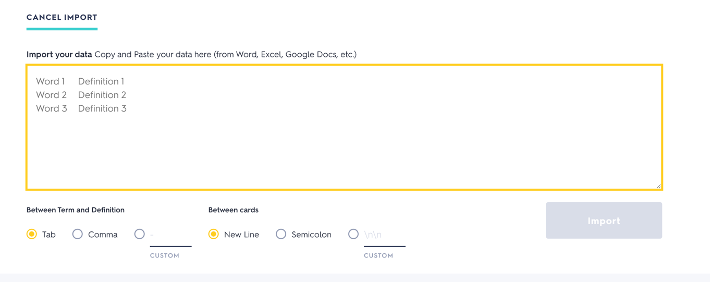

# quizlet-cards-ai-generator

The idea of this service is based on [ValeriiZhyla/anki-cards-ai-generator](https://github.com/ValeriiZhyla/anki-cards-ai-generator)

Flash cards and spaced repetition can be combined into powerful and effective tool for many areas of studying, from languages to university subjects.
The creation of these cards is an interesting, but sometimes time-consuming process.

However, there is no opportunity to create quizlet cards via API.

The only option is to Import cards by Quizlet UI.



## Prerequisites
1. Your [OpenAI API](https://platform.openai.com/api-keys) key is required. You can set environment variable OPENAI_API_KEY (.env is supported) or use --openai_api_key option.
2. Create venv with python 3.11.8
3. Run `make install`

Workflow:

```shell
python -m generator.read-generate-import \
  ./input/english.csv \
  --openai-api-key 'YOUR_OPENAI_API_KEY' \
  --processing-directory-path 'YOUR_PROCESSING_DIRECTORY' \  # Output directory were target cards will be stored. The directory should exist'
  --deck_name 'YOUR_DECK_NAME' \  # The file with cards will be generated in `processing directory` with this name
  --language {english,polish} \  # The target language. The default language is 'english'
  --level {A1,A2,B1,B2,C1,C2} \  # The target language level. The default level is C1
  --dictionary_urls ['TARGET_DICTIONARY_1', 'TARGET_DICTIONARY_2'] \
  --quizlet_import_symbol_between_term_and_definition 'SYMBOL' \  # See Quizlet import UI. Symbol between term and definition
  --quizlet_import_symbol_between_cards 'SYMBOL' \  # See Quizlet import UI. Symbol between cards
  --cache_name 'CACHE_NAME' # If you do not want to accidentally create multiple cards for the same word, you can store word in cache
```
Defaults are:
- OpenAI API key is and expected to be set in environment variable OPENAI_API_KEY
- Processing Directory is `/output/{language_name}`
- Deck name is autogenerated, containing current date
- Language is english
- Level is C1
- Dictionaries:
  - English:
      - https://oxfordlearnersdictionaries.com
      - https://ldoceonline.com
  - Polish
      - https://wsjp.pl
- Quizlet import UI. Symbol between term and definition is ','
- Quizlet import UI. Symbol between cards is ';;;\n\n'
- Cache name by default generated by `/cache/{language_name}.txt`

### Language Levels
You can choose a CERF language level for card generation: A1, A2, B1, B2, C1, C2.

Note, that not all words can be explained at the beginner levels.

### Custom settings
```bash
python -m generator.read-generate-import ./demo/input_words.csv ./processing  \
          --openai-api-key 'YOUR_OPENAI_API_KEY' \
          --language="polish" \
          --level="B2" \
          --deck_name="my_amazing_deck"
```

### Input
This tool reads a file as input.
It can be a CSV file with semicolon as separator (you can use commas in sentences and context), or an Excel file.
Header "word;context" is expected.
Example:
```csv
word;context
tax fraud;
purchasing power parity;economy
affect;
consciousness;the state of human being
free will;
```

### Cost
Billing: https://platform.openai.com/settings/organization/billing/overview

Text generation is cheap, less than 0.01$ per card.

## FAQ
Q: I don't like the generated cards!
A: At first, try to regenerate the card, maybe provide more context. If the tool creates something totally wrong - please create an issue on GitHub. You can also adjust the prompts at your own discretion.
*****
Q: Will this tool correct my typos?
A: No, Garbage In - Garbage Out. If ChatGPT understands your input, the tool will create a contextually correct card that may include your typo on the back of the card. You can fix it manually in the anki app or regenerate the card.
*****
Q: Card text is too complicated, I don't know these words or constructions!
A: You can set the language complexity with --level option.
*****
Q: I like the tool, but I would like to use it with another language...
A: For this purpose, it is required to:
1. Check whether the language is supported by ChatGPT.
2. Translate prompts for text generation, and adjust them. Probably we will require help of person with a good language level.
3. Good dictionary, to place a link in cards (dictionary can be ignored).
4. Create an issue with this information, or create a fork.
*****
Q: I'm getting an error:
```bash
ModuleNotFoundError: No module named 'openai'
```
A: Tool is supplied with [requirements.txt](requirements.txt), which should be used with venv. When requirements.txt and venv don't ring a bell, then you can install the dependencies in your normal python environment using `pip install`:
```bash
make install
```
*****
Q: I'm getting an error:
```bash
ValueError: Missing required columns: word, context
```
A: Probably you are using a CSV file, which is not separated with semicolon (this guy `;`).

